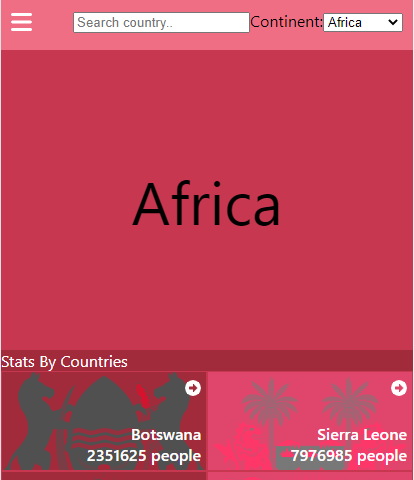
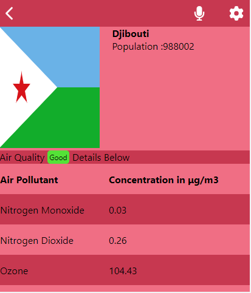

# Metrics App

This is a Metrics app that fetches metrics data (air-pollution) of countries in the world 

### Live Demo Link
[View Site](https://metric-app-rich.netlify.app/)





## Built With

- React
- Redux

## Getting Started
To get a local copy up and running follow these simple example steps.

## Prerequisites
- Have a good knowledge on how to parse UI designs
- Have VSCode or other text editor installed. [Link to download VSCode](https://code.visualstudio.com/download)
- Install node package. [Link to download node](https://nodejs.org/en/download/)
- Have git installed.[Link to download git](https://git-scm.com/downloads)
- Create a github repository.
- create new react-redux app [Check this link to learn how](https://reactjs.org/docs/create-a-new-react-app.html)
- Use React-Redux

## Setup
- ````git clone git@github.com:assadounto/wiki-app.git````
-  ````cd wiki-app ````
-  ````npm install ````
-  ````npm start ````

-Follow the HTML-CSS linter confuguration to docs to setup linters [Link to Microverse linter docs](https://github.com/microverseinc/linters-config)


## Run tests

For tracking linters errors locally, you need to follow these steps:
- For tracking linter errors in HTML file run:

1. ````npm install --save-dev hint@6.x````
2. ````npx hint .````

- For tracking linter errors in CSS file run:

1. ````npm install --save-dev stylelint@13.x stylelint-scss@3.x stylelint-config-standard@21.x stylelint-csstree-validator@1.x````
2. ````npx stylelint "**/*.{css,scss}"````

- For tracking linter errors in Javascript file run:

1. ````npm install --save-dev eslint@7.x eslint-config-airbnb-base@14.x eslint-plugin-import@2.x babel-eslint@10.x````
2. ````npx eslint .````

## Deployment

- Use GitHub pages to deploy website
- For more information about publishing sources, see [About github pages](https://pages.github.com/)

## Author

👤 **Rich Adu**

- GitHub: 
    - [assadounto](https://www.github.com/assadounto)
- Twitter:
    - [@adukyerer](https://www.twitter.com/adukyerer)
## 🤝 Contributing

Contributions, issues, and feature requests are welcome!

Feel free to check the [issues page](../../issues/).

## Show your support

Give a ⭐️ if you liked this project!

## Acknowledgments
- Original design idea by [Nelson Sakwa on Behance.](https://www.behance.net/sakwadesignstudio)
- Microverse 
- Coding Partners
- Code Reviewers

## 📝 License

This project is [MIT](./MIT.md) licensed.
